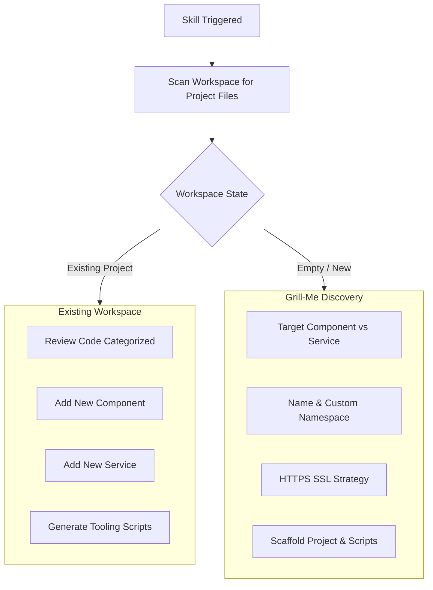

# VertiGIS Studio Web SDK: Interactive Scaffolding, Code Reviews & Tooling

## Overview
When interacting with a developer, the agent follows an interactive consultation protocol ("Grill-Me" mode) to discover project requirements, verify SSL certificates, and audit existing code with categorized severity levels.

---

## 1. Interactive Onboarding & Discovery Flow



---

## 2. Categorized Code Review Audit Framework

When performing a code review or when asked to **"Review my code"**, audit the codebase according to the specific extension type and categorize findings by severity level:

### 🧩 A. Web Component Review (`ComponentModelBase` + React View)

#### 🔴 Critical (Breaking Issues & Runtime Failures)
- **`<LayoutElement>` Wrapper**: React view MUST wrap all JSX inside `<LayoutElement {...props}>`. Omitting this breaks SDK layout slotting, sizing, and Designer drag-and-drop.
- **MobX `observer()`**: React view MUST be wrapped with `observer()` from `mobx-react-lite` if reading model properties. Without it, model observable changes will not trigger re-renders.
- **Designer Integration**: Props interface MUST extend `LayoutElementProperties<TModel>` so parameters are exposed to Web Designer.
- **ArcGIS AMD Star Imports**: Utility/function modules (`projection`, `geometryEngine`) must use star imports (`import * as projection from "@arcgis/core/geometry/projection"`). Default imports cause `Unsupported AMD module` errors.
- **Host Peer Dependencies**: NEVER bundle duplicate copies of `@vertigis/web`, `@arcgis/core`, `react`, or `@mui/material`.

#### 🟡 Warnings (Architectural & State Deficiencies)
- **Missing Error Boundary**: Custom widget contents should be wrapped in an `<ErrorBoundary>` to prevent a single component crash from breaking the entire application layout.
- **Color Token Violations**: Avoid hardcoded hex/RGB colors. Map all styling to VertiGIS CSS variable tokens (`var(--primaryBackground)`, `var(--primaryForeground)`).
- **CSS Modules / Custom CSS**: Avoid creating `.css` or `.module.css` files. Use MUI's `sx` prop referencing CSS tokens.
- **Resource Leaks in Lifecycle**: Any event subscriptions, background intervals, or MobX reactions created in `_onInitialize()` MUST be disposed in `_onDestroy()`.
- **Complex `@serializable` Types**: Non-primitive properties (like `Date` or custom classes) in `@serializable` must have explicit `{ serializer, deserializer }` definitions.

#### 🔵 Recommendations (Cleanliness, Maintainability & a11y)
- **Prefer MUI Component Equivalents**: Where available, use `@mui/material` components (`<Box>`, `<Stack>`, `<Typography>`, `<Button>`, `<TextField>`) instead of bare unstyled HTML tags (`<button>`, `<input>`, `<span>`, `<p>`) to inherit VertiGIS themes and WCAG accessibility automatically. Plain structural `<div>` containers for layout/refs are completely acceptable.
- **Component Decomposition**: If a component exceeds ~150 lines, decompose it into `hooks/` (state/logic), `components/` (sub-views), and `utils/` (helpers).
- **Accessibility (a11y)**: Interactive MUI elements (`IconButton`, `Button`, `TextField`) should include `aria-label` or `aria-labelledby`.
- **JSDoc Documentation**: Decorate model and props interface properties with `@displayName` and `@description`.


---

### ⚙️ B. Web Service Review (`ServiceBase` Singletons)

#### 🔴 Critical (Breaking Issues & Runtime Failures)
- **Registration**: Service must be registered in `src/index.ts` via `registry.registerService({ id, getService })`.
- **Unique Service ID**: Service identifier must not collide with core VertiGIS service IDs.

#### 🟡 Warnings (Architectural & State Deficiencies)
- **Memory Management**: Timers, polling loops, or event bus subscriptions must be cleared in `_onDestroy()`.
- **Decoupled Messaging**: Prefer invoking commands and operations via `this.messages.commands` / `this.messages.operations` over hard-coding direct references to other models.

#### 🔵 Recommendations (Cleanliness & Maintainability)
- **Dependency Injection**: Use `@inject("serviceName")` with strict interface typing when consuming other services.
- **Helper Extraction**: Move heavy calculation or domain logic into `utils/<domain>Helpers.ts`.

---

## 3. HTTPS Certificate Generation (OpenSSL)

VertiGIS Studio Web development requires running the local dev server over HTTPS (port 3000).

### Option A — Generate Self-Signed Certificate via OpenSSL
```bash
mkdir -p certs
openssl req -x509 -newkey rsa:2048 -keyout certs/key.pem -out certs/cert.pem -days 365 -nodes -subj "/CN=localhost"
```

### Option B — Custom Certificate Path
Configure `package.json`:
```json
{
  "scripts": {
    "start": "vertigis-web-sdk start --https --key ./certs/key.pem --cert ./certs/cert.pem"
  }
}
```

---

## 4. Helper Scripts Templates

### `start.bat` (Windows Port 3000 Killer & Starter)
```cmd
@echo off
set PORT=3000
echo Checking if port %PORT% is in use...
for /f "tokens=5" %%a in ('netstat -aon ^| findstr :%PORT%') do (
    echo Killing stale process on port %PORT% (PID: %%a)...
    taskkill /F /PID %%a >nul 2>&1
)
echo Starting VertiGIS Web SDK development server...
npm start
```

### `build.bat` (Windows Build Script)
```cmd
@echo off
echo Building production VertiGIS Web SDK library bundle...
npm run build
if %ERRORLEVEL% EQU 0 (
    echo Build completed successfully in dist/ directory.
) else (
    echo Build failed with error code %ERRORLEVEL%.
)
```

### `start.sh` (Linux / macOS Port 3000 Killer & Starter)
```bash
#!/bin/bash
PORT=3000
echo "Checking if port $PORT is in use..."
PID=$(lsof -ti :$PORT)
if [ ! -z "$PID" ]; then
    echo "Killing stale process on port $PORT (PID: $PID)..."
    kill -9 $PID 2>/dev/null
fi
echo "Starting VertiGIS Web SDK development server..."
npm start
```

### `build.sh` (Linux / macOS Build Script)
```bash
#!/bin/bash
echo "Building production VertiGIS Web SDK library bundle..."
npm run build
```
