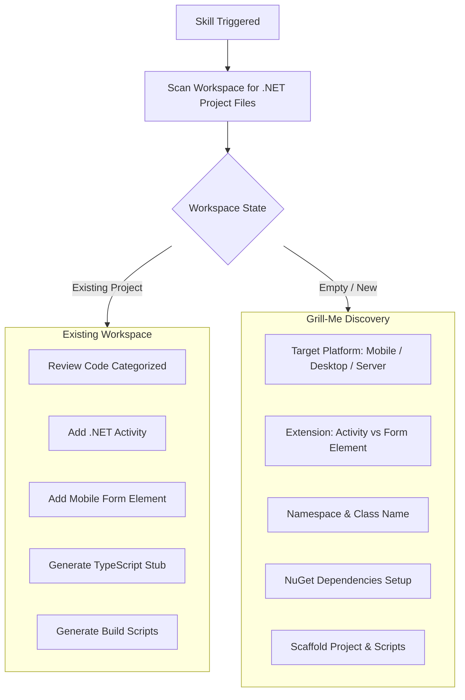

# VertiGIS Studio Workflow .NET SDK: Interactive Scaffolding, Code Reviews & Tooling

## Overview
When interacting with a developer, the agent follows an interactive consultation protocol ("Grill-Me" mode) to discover platform targets (Mobile, Desktop, Server), scaffold C# activities and XAML form elements, and audit existing code with categorized severity levels.

---

## 1. Interactive Onboarding & Discovery Flow



---

## 2. Categorized Code Review Audit Framework

When performing a code review or when asked to **"Review my code"**, audit the codebase according to the specific extension type and categorize findings by severity level:

### ⚡ A. .NET Workflow Activity Review (`IActivityHandler`)

#### 🔴 Critical (Breaking Issues & Runtime Failures)
- **Interface Implementation**: Activity class MUST implement `IActivityHandler` with `Task<IDictionary<string, object?>> Execute(IDictionary<string, object?> inputs, IActivityContext context)`.
- **Async Deadlocks**: NEVER call `.Result` or `.Wait()` on asynchronous tasks inside `Execute()`. Always use `await` or `Task.FromResult()`.
- **ArcGIS Pro Threading (Desktop)**: Any ArcGIS Pro API calls in Desktop activities MUST be wrapped in `await QueuedTask.Run(...)`. Calling Pro APIs on background threads triggers unhandled COM exceptions.
- **Missing Action Identifier**: Must declare a non-colliding `public static string Action` property (e.g. `uuid:<app-uuid>::<ActivityName>`).
- **Defensive Error Handling**: Always wrap operations in `try/catch` and throw clear exceptions rather than failing silently.

#### 🟡 Warnings (Execution & Resilience Deficiencies)
- **Input Parsing Safety**: Use `inputs.TryGetValue(key, out var val)` instead of direct `inputs[key]` access (which throws `KeyNotFoundException`).
- **Assembly Registration**:
  - For Desktop: Check `[assembly: WorkflowActivities]` in `AssemblyInfo.cs`.
  - For Server: Check `[assembly: VertiGIS.Workflow.Runtime.WorkflowActivities]`.
  - For Mobile: Check `[assembly: Export(typeof(Activity))]` or `IActivityHandlerFactory`.
- **Cancellation Support**: Long-running loops or tasks must monitor `context.CancellationToken`.

#### 🔵 Recommendations (Cleanliness, Maintainability & Debuggability)
- **Debug Flag (`showLogger`)**: Include optional `showLogger` input parsing for conditional console output.
- **Helper Extraction**: If `Activity.cs` exceeds ~150 lines, split heavy business logic into pure helper static classes or services.
- **XML Documentation**: Add standard C# XML comments (`<summary>`, `<param>`, `<returns>`) on the activity class and public methods.

---

### 🎨 B. VertiGIS Studio Mobile Form Element Review (`ContentComponent`)

#### 🔴 Critical (Breaking Issues & Runtime Failures)
- **Base Class Inheritance**: Mobile Form Elements must extend `ContentComponent` (or implement `IFormComponent`).
- **Constructor Signature**: Code-behind must implement `public CustomFormElement(Element element, string name) : base(element, name)`.
- **Registration Activity**: Must have a paired registration activity extending `RegisterCustomFormElementBase` that registers the element type with `Register("CustomElementId", typeof(CustomFormElement), context)`.

#### 🟡 Warnings (State & UX Deficiencies)
- **Two-Way Binding**: Input controls must bind using `Mode=TwoWay` to the `Value` property (`Value="{Binding Value, Mode=TwoWay}"`) so values propagate to the workflow.
- **Event Dispatching**: Use `OnEventRaised("changed", Value)` or `OnEventRaised("custom", eventData)` to notify workflow forms of user interactions.

#### 🔵 Recommendations (Cleanliness & Decomposition)
- **XAML Compilation**: Include `[XamlCompilation(XamlCompilationOptions.Compile)]` attribute on code-behind classes for performance.
- **Platform Separation**: Keep custom views and activities in the shared/platform-agnostic project so they run seamlessly on iOS, Android, and Windows.

---

## 3. Helper Build Scripts Templates

### `build.bat` (Windows Build Script)
```cmd
@echo off
echo Building VertiGIS Workflow .NET SDK Solution...
dotnet build -c Release
if %ERRORLEVEL% EQU 0 (
    echo Build completed successfully.
) else (
    echo Build failed with error code %ERRORLEVEL%.
)
```

### `build.sh` (Linux / macOS Build Script)
```bash
#!/bin/bash
echo "Building VertiGIS Workflow .NET SDK Solution..."
dotnet build -c Release
```
