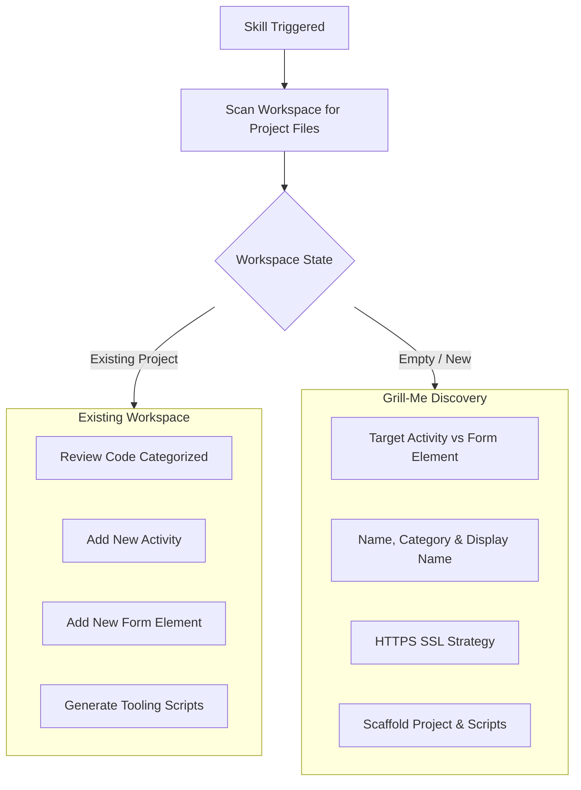

# VertiGIS Studio Workflow SDK: Interactive Scaffolding, Code Reviews & Tooling

## Overview
When interacting with a developer, the agent follows an interactive consultation protocol ("Grill-Me" mode) to discover project requirements, verify SSL certificates, and audit existing code with categorized severity levels.

---

## 1. Interactive Onboarding & Discovery Flow



---

## 2. Categorized Code Review Audit Framework

When performing a code review or when asked to **"Review my code"**, audit the codebase according to the specific extension type and categorize findings by severity level:

### ⚡ A. Workflow Activity Review (`IActivityHandler`)

#### 🔴 Critical (Breaking Issues & Runtime Failures)
- **Defensive `try/catch` Error Handling**: The `execute()` method MUST wrap core execution logic in a `try/catch` block and throw structured `Error` instances. Uncaught exceptions crash the workflow execution runtime.
- **Inline Dropdown Literals**: Input properties intended as dropdowns in Workflow Designer MUST use inline string literal unions (e.g. `type: 'a' | 'b' | string;`). Extracting to external type aliases breaks Designer dropdown recognition.
- **ArcGIS AMD Star Imports**: Utility/function modules (`projection`, `geometryEngine`) must use star imports (`import * as projection from "@arcgis/core/geometry/projection"`).
- **Strict Return Types**: `execute()` must return a strictly typed `Promise<TOutputs>` interface, NEVER `any` or `Promise<any>`.
- **Barrel Export**: Activity must be exported from `src/index.ts` with a name ending in `Activity`.

#### 🟡 Warnings (Execution & Resilience Deficiencies)
- **Missing `runActivity` Guard**: Activities should check `inputs.runActivity !== false` and return safe empty defaults if bypassed.
- **Missing `@required` Tags**: Mandatory input parameters must be annotated with `@required`.
- **Missing Toolbox Metadata**: The class must include `@category`, `@defaultName`, `@helpUrl`, and `@supportedApps`.
- **Blocking Operations**: Avoid synchronous blocking loops; use asynchronous helpers for I/O and heavy computations.

#### 🔵 Recommendations (Cleanliness, Maintainability & Debuggability)
- **Debug Flag (`showLogger`)**: Include optional `showLogger?: boolean` input for conditional console logging.
- **Helper Extraction**: If `main.ts` exceeds ~150 lines, split domain helpers into `utils/<domain>Helpers.ts`.
- **JSDoc Documentation**: Annotate all input and output fields with `@displayName` and `@description`.

---

### 🎨 B. Workflow Form Element Review (`FormElementProps` + `FormElementRegistration`)

#### 🔴 Critical (Breaking Issues & Runtime Failures)
- **MUI Component Mandate**: Views MUST use `@mui/material` components (`<Box>`, `<TextField>`, `<Button>`). Bare HTML input tags (`<input>`, `<button>`, `<div>`) break styling and theme consistency.
- **Wiring Standard Props**: MUST destructure and wire `enabled`, `visible`, and `readOnly` to MUI properties (`disabled={!enabled}`, `inputProps={{ readOnly }}`).
- **Registration ID Match**: `FormElementRegistration.id` MUST match the Custom Type name in Workflow Designer.
- **Barrel Export**: Form element must be exported from `src/index.ts` with a name ending in `Registration`.

#### 🟡 Warnings (State & UX Deficiencies)
- **State Persistence (Tab Remounts)**: Critical workflow state MUST be saved in `props.setValue()` or `props.setProperty()` rather than local React `useState`. State stored only in `useState` is lost when navigating between form tabs.
- **Color Token Violations**: Avoid hardcoded hex/RGB colors. Map styling to VertiGIS CSS variable tokens (`var(--primaryBackground)`, `var(--primaryForeground)`).
- **Multiple Output Handling**: When producing secondary outputs, use `props.setProperty("propName", value)` so they are accessible via *Get Form Element Property*.

#### 🔵 Recommendations (Accessibility, Cleanliness & Events)
- **WCAG Accessibility (a11y)**: Add `aria-label`, `aria-pressed`, and keyboard event handlers (`onKeyDown` for Space/Enter keys) on interactive components.
- **Structured Custom Events**: Dispatch custom events using structured payloads: `props.raiseEvent("custom", { customEventType: "eventName", data: ... })`.
- **Component Decomposition**: Split complex elements into `hooks/`, `components/`, and `utils/`.

---

## 3. HTTPS Certificate Generation (OpenSSL)

Workflow SDK local development server runs on HTTPS (`https://localhost:5000/activitypack.json`).

### Option A — Generate Self-Signed Certificate via OpenSSL
```bash
mkdir -p certs
openssl req -x509 -newkey rsa:2048 -keyout certs/key.pem -out certs/cert.pem -days 365 -nodes -subj "/CN=localhost"
```

### Option B — Custom Certificate Path
Configure `package.json`:
```json
{
  "scripts": {
    "start": "vertigis-workflow-sdk start --https --key ./certs/key.pem --cert ./certs/cert.pem"
  }
}
```

---

## 4. Helper Scripts Templates

### `start.bat` (Windows Port 5000 Killer & Starter)
```cmd
@echo off
set PORT=5000
echo Checking if port %PORT% is in use...
for /f "tokens=5" %%a in ('netstat -aon ^| findstr :%PORT%') do (
    echo Killing stale process on port %PORT% (PID: %%a)...
    taskkill /F /PID %%a >nul 2>&1
)
echo Starting VertiGIS Workflow SDK development server on port %PORT%...
npm start
```

### `build.bat` (Windows Build Script)
```cmd
@echo off
echo Building production VertiGIS Workflow activity pack...
npm run build
if %ERRORLEVEL% EQU 0 (
    echo Build completed successfully in build/ directory.
) else (
    echo Build failed with error code %ERRORLEVEL%.
)
```

### `start.sh` (Linux / macOS Port 5000 Killer & Starter)
```bash
#!/bin/bash
PORT=5000
echo "Checking if port $PORT is in use..."
PID=$(lsof -ti :$PORT)
if [ ! -z "$PID" ]; then
    echo "Killing stale process on port $PORT (PID: $PID)..."
    kill -9 $PID 2>/dev/null
fi
echo "Starting VertiGIS Workflow SDK development server on port $PORT..."
npm start
```

### `build.sh` (Linux / macOS Build Script)
```bash
#!/bin/bash
echo "Building production VertiGIS Workflow activity pack..."
npm run build
```
